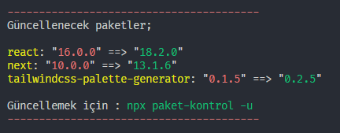
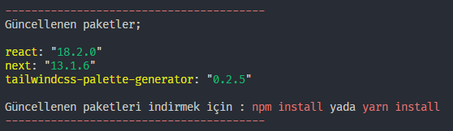

# paket-kontrol

> Projenizde yüklü npm paketlerinin versiyonlarının güncel olup olmadığını kontrol etmeniz için yardımcı cli pakedi.

## İndirme

[Node.js](https://nodejs.org) 14+ sürümünün kurulu olduğundan emin olun. Ardından aşağıdakileri çalıştırın:

```sh
npm install --global paket-kontrol@latest
```

yada

```sh
yarn global add paket-kontrol@latest
```

## Kullanım

### Paket kontrol için

```sh
paket-kontrol
```

yada

```sh
npx paket-kontrol
```



### Güncel olmayan paketleri güncellemek için.

```sh
paket-kontrol -u
```

yada

```sh
npx paket-kontrol -u
```



### TODO (Yapılacaklar)

- [x] `--dev, -d` dev paketleri güncelleme yapılacak.
- [x] `--peer, -p` peer paketleri güncelleme yapılacak
- [ ] `--all, -a` tüm paketleri güncelleme yapılacak
- [ ] `--name, -n [DEPENDENCIES_NAME]` belirtilen addaki paketleri güncelleme yapılacak

## İlişkili & Önerilen

- [npm-check-updates](https://github.com/raineorshine/npm-check-updates) - Npm paketlerinizi güncel tutmanız için ilham aldığım paket.
